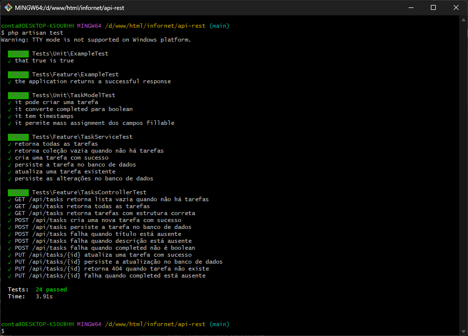

## Sobre o Projeto

Resposta para a primeira questão do teste técnico.
Segue abaixo algumas informações do que foi feito

---

## 🎯 Princípios SOLID Aplicados

### S - Single Responsibility Principle (Responsabilidade Única)

Cada classe tem UMA única responsabilidade:

- **`StoreTaskRequest` / `UpdateTaskRequest`** → Apenas validam dados de entrada
- **`TaskService`** → Apenas implementa lógica de negócio
- **`TasksController`** → Apenas coordena requisições HTTP
- **`TaskResource`** → Apenas formata respostas JSON
- **`Task` (Model)** → Apenas representa dados

**Exemplo:**
```php
// Antes: Controller com múltiplas responsabilidades
class TasksController {
    public function store(Request $request) {
        $validated = $request->validate([...]); // Validação
        $task = Task::create($validated);       // Persistência
        return response()->json([...]);         // Formatação
    }
}

// Depois: Responsabilidades separadas
class TasksController {
    public function store(StoreTaskRequest $request) {
        $task = $this->taskService->createTask($request->validated());
        return response()->json([...]);
    }
}
```

---

### O - Open/Closed Principle (Aberto/Fechado)

Aberto para extensão, fechado para modificação:

```php
// Pode estender TaskService sem modificar código existente
class NotifyingTaskService extends TaskService {
    public function createTask(array $taskData): Task {
        $task = parent::createTask($taskData);
        // Adiciona notificação
        $this->notificationService->send($task);
        return $task;
    }
}

// Usa naturalmente via injeção de dependência
$controller = new TasksController(new NotifyingTaskService());
```

---

### L - Liskov Substitution Principle (Substituição de Liskov)

Qualquer implementação pode substituir a classe base:

```php
interface TaskServiceInterface {
    public function getAllTasks(): Collection;
    public function createTask(array $data): Task;
    public function updateTask(Task $task, array $data): Task;
}

// Qualquer implementação pode ser usada
class TaskService implements TaskServiceInterface { }
class CachedTaskService implements TaskServiceInterface { }

// Controller funciona com qualquer implementação
public function __construct(TaskServiceInterface $taskService) {
    $this->taskService = $taskService;
}
```

---

### I - Interface Segregation Principle (Segregação de Interface)

Interfaces específicas por responsabilidade:

```php
// ❌ ERRADO: Interface muito grande
interface TaskManagerInterface {
    public function getAllTasks();
    public function createTask();
    public function exportToCsv();
    public function sendEmail();
}

// ✅ CORRETO: Interfaces focadas
interface TaskRepositoryInterface {
    public function getAllTasks();
    public function createTask();
}

interface TaskExporterInterface {
    public function exportToCsv();
}
```

---

### D - Dependency Inversion Principle (Inversão de Dependência)

Depende de abstrações (interfaces), não de implementações concretas:

```php
class TasksController extends Controller
{
    // Depende de abstração (TaskService), não de implementação concreta
    private TaskService $taskService;

    // Injeção de dependência via construtor
    public function __construct(TaskService $taskService)
    {
        $this->taskService = $taskService;
    }

    public function store(StoreTaskRequest $request): JsonResponse
    {
        // Usa abstração, não sabe detalhes de implementação
        $task = $this->taskService->createTask($request->validated());
        
        return response()->json([...]);
    }
}
```
---

## 🧹 Clean Code Aplicado

### ✅ Nomes Significativos

```php
public function getAllTasks() { }
public function createTask() { }
public function updateTask() { }
```

### ✅ Funções Pequenas e Focadas

```php
// Cada método faz apenas uma coisa
public function createTask(array $taskData): Task
{
    return Task::create($taskData);  // Apenas 1 linha, 1 responsabilidade
}
```

### ✅ Sem Duplicação (DRY)

```php
// Método reutilizável de envio de response
// Mas respeitando SOLID, não coloquei isso no Controller
```

### ✅ Tratamento de Erros

```php
// Validação com mensagens customizadas em português
public function messages(): array
{
    return [
        'title.required' => 'O título é obrigatório',
        'description.required' => 'A descrição é obrigatória',
        'completed.boolean' => 'O status deve ser verdadeiro ou falso',
    ];
}
```

### ✅ Type Hints Completos

```php
// Todos os métodos têm tipos definidos
public function updateTask(Task $task, array $taskData): Task
{
    $task->update($taskData);
    return $task;
}
```

---

## 🛠️ Testes unitários (Pesk)



---
## 📁 Estrutura do Projeto

```
api-rest/
├── app/
│   ├── Http/
│   │   ├── Controllers/
│   │   │   └── TasksController.php      # Coordena requisições HTTP
│   │   ├── Requests/
│   │   │   ├── StoreTaskRequest.php     # Valida criação de tasks
│   │   │   └── UpdateTaskRequest.php    # Valida atualização de tasks
│   │   └── Resources/
│   │       └── TaskResource.php         # Formata respostas JSON
│   │
│   ├── Models/
│   │   └── Task.php                     # Representa dados de tasks
│   │
│   └── Services/
│       └── TaskService.php              # Lógica de negócio
│
├── database/
│   ├── factories/
│   │   └── TaskFactory.php              # Factory para testes
│   └── migrations/
│       └── *_create_tasks_table.php     # Estrutura do banco
│
├── routes/
│   └── api.php                          # Rotas da API
│
└── tests/
    ├── Feature/
    │   ├── TaskServiceTest.php          # Testes do Service
    │   └── TasksControllerTest.php      # Testes da API
    └── Unit/
        └── TaskModelTest.php            # Testes do Model

```
